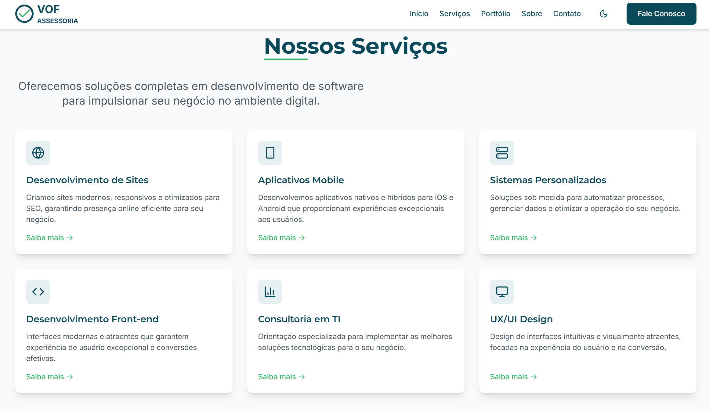
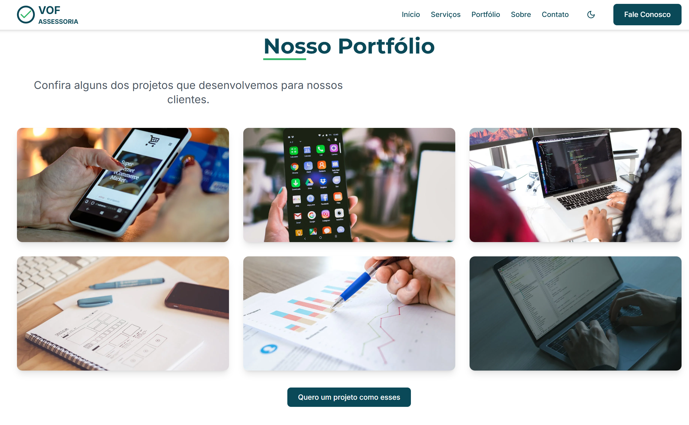
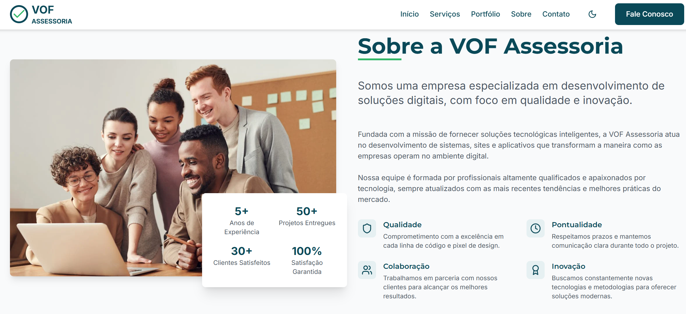
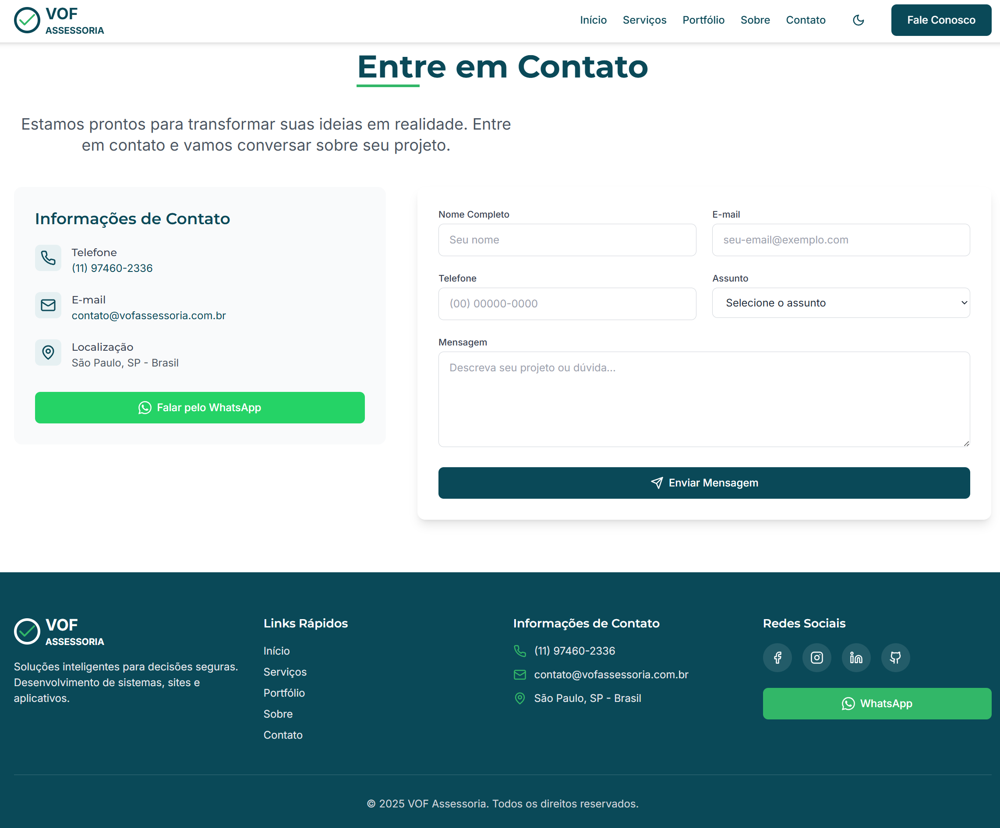

# VOF Assessoria – Site Institucional

Este repositório contém o código-fonte do site institucional da VOF Assessoria, disponível em [vofassessoria.com.br](http://www.vofassessoria.com.br). O projeto foi desenvolvido com foco em performance, responsividade e experiência do usuário, utilizando tecnologias modernas do ecossistema JavaScript.

## 🚀 Tecnologias Utilizadas

- **React** – Biblioteca JavaScript para construção de interfaces de usuário.
- **Tailwind CSS** – Framework utilitário para estilização rápida e responsiva.
- **Vite** – Ferramenta de build e desenvolvimento rápido para projetos front-end.
- **React Router** – Gerenciamento de rotas no lado do cliente.
- **React Icons** – Biblioteca de ícones para React.

## 🎯 Objetivo

Desenvolver uma presença digital sólida para a VOF Assessoria, destacando seus serviços e facilitando o contato com clientes em potencial. O site visa transmitir profissionalismo e confiança, alinhando-se à identidade da marca.

## 📁 Estrutura do Projeto

## 📸 Capturas de Tela

Abaixo estão algumas visualizações do site em funcionamento:

*Página inicial do site com destaque institucional.*

*Apresentação dos serviços e diferencial da VOF.*

*Detalhamento das soluções oferecidas.*

*Área de contato para captação de novos clientes.*

*Layout adaptado para dispositivos móveis.*

## 📡 Deploy

O site está hospedado em: [https://vofassessoria.com.br](https://vofassessoria.com.br)

## 📬 Contato

Para mais informações ou oportunidades de colaboração:

- **Nome**: Vagner
- **Email**: [vagner@vofassessoria.com.br](mailto:vagner@vofassessoria.com.br)
- **LinkedIn**: [linkedin.com/in/vagner-florencio-85679860](https://www.linkedin.com/in/vagner-florencio-85679860/)
- **GitGub**: [github.com/v4gn32](https://github.com/v4gn32)

---

*Este projeto é parte do portfólio profissional de Vagner e está disponível para fins de demonstração e aprendizado.*
